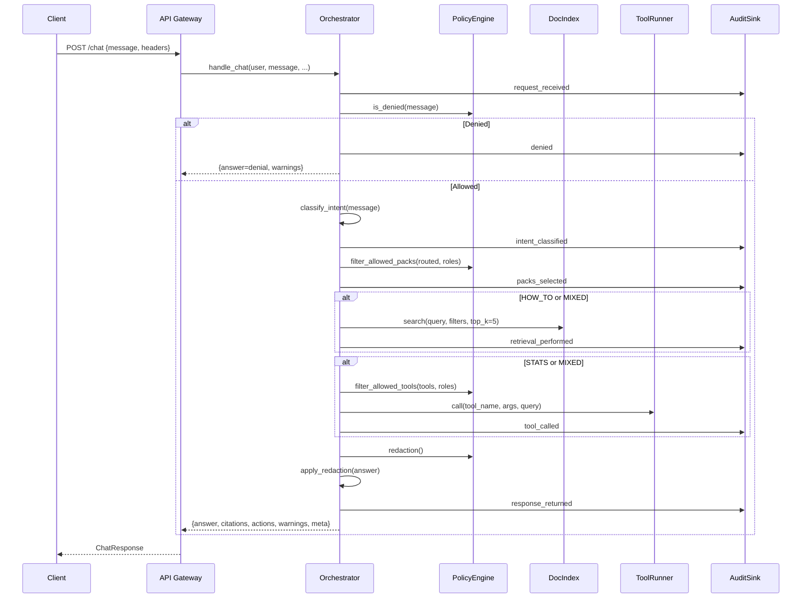

# Architecture

## Component Overview

| Component | Module | Responsibility |
|---|---|---|
| **API Gateway** | `app/api.py` | FastAPI endpoints, request parsing, response shaping |
| **Orchestrator** | `app/core/orchestrator.py` | Intent routing, policy checks, retrieval + tool orchestration |
| **Intent Classifier** | `app/core/intent.py` | Heuristic keyword classifier → `how_to \| stats \| security \| mixed` |
| **Pack Registry** | `app/core/packs.py` | Pack registration, keyword-based routing |
| **Policy Engine** | `app/core/policy.py` | RBAC allowlists, deny-phrase checks, redaction settings |
| **Doc Index** | `app/core/doc_index.py` | In-memory hybrid (BM25 + vector) and vector-only search backends |
| **Ingest Pipeline** | `app/core/ingest.py` | Filesystem doc loader → chunker → index |
| **Chunker** | `app/core/chunking.py` | Markdown-aware section splitting with overlap |
| **Embedder** | `app/core/embeddings.py` | Hash-based (default) and Sentence-Transformer embeddings |
| **Tool Registry** | `app/core/tools.py` | Tool definition, schema validation, connector dispatch |
| **Tool Arg Extractor** | `app/core/tool_args.py` | Heuristic extraction of timeframe/service/env from message |
| **Redaction** | `app/core/redaction.py` | Email masking, long-ID masking, small-count suppression |
| **Audit** | `app/core/audit.py` + `audit_sinks.py` | Structured event logging per trace ID |
| **Connectors** | `app/connectors/` | `mock`, `http` stub, `sql_readonly` stub |
| **Sample Pack** | `packs/sample_service/` | Reference pack with two mock stats tools + how-to docs |

---

## Request Lifecycle — `/chat`



---

## Pack Extension Model

A **Pack** is the unit of extensibility. To add a new product or service, create a pack under `packs/<pack_id>/`:

```
packs/
  my_service/
    __init__.py
    pack.py       ← ProductPack subclass (keywords, doc_globs, tools, glossary)
    tools.py      ← handler functions for each ToolDef
```

Then register the pack in `app/api.py`:

```python
registry.register(MyServicePack())
```

Use the scaffolding script to bootstrap:

```bash
python scripts/new_pack.py --pack_id my_service --display_name "My Service"
```

---

## Policy Model

Policy is defined in a YAML file (`config/policy.yaml`):

```yaml
version: 1

deny_patterns:
  - "export"                    # exact phrase (normalized)
  - "re:dump\\s+db"            # regex (re: prefix)

redaction:
  mask_emails: true
  mask_long_ids: true
  suppress_small_counts: null   # set to integer threshold to suppress tiny counts

roles:
  Viewer:
    allowed_packs: ["sample_service"]
    allowed_tools: ["sample.stats.*"]
  Admin:
    allowed_packs: ["*"]
    allowed_tools: ["*"]
```

Glob patterns in `allowed_packs` and `allowed_tools` support:

- `*` — match anything
- `pack_id.*` — match any tool in a namespace
- Exact string — exact match

---

## Environment Variables

See [`.env.example`](../.env.example) for the full list. Key variables:

| Variable | Default | Description |
|---|---|---|
| `POLICY_PATH` | `config/policy.yaml` | Path to RBAC policy |
| `DATA_DIR` | `data` | Root for pack docs |
| `DOC_INDEX_BACKEND` | `hybrid` | `hybrid` or `vector_only` |
| `EMBEDDING_BACKEND` | `hash` | `hash` (zero-dep) or `st` (sentence-transformers) |
| `AUDIT_SINK` | `memory` | `memory` or `file` |
